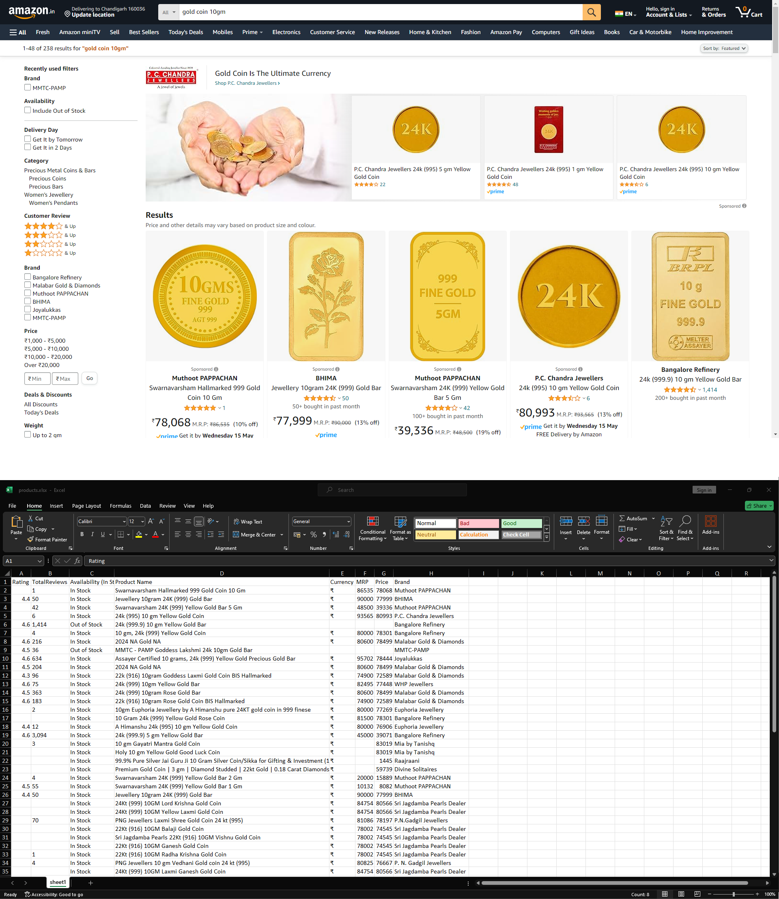

# Web Scraping eCommerce productData (Module #6 Node.jS Day 4 Classwork)


This assignment is designed to scrape products data from [amazon.in](https://www.amazon.in/) and store it into excel file (products.xlsx)
following information is being scraped:
+ Rating : Product Rating
+ Currency : like ₹ or $
+ Product Name
+ MRP : Maximum Retail Price
+ Price : Current Selling Price
+ Brand 
 

## Objectives
+ learn how to scrape data using puppeteer
+ save scraped data into excel file (.xlsx) 

## How execute script on yorus local machine
```bash
node index.mjs
```
to specify custom url from [amazon.in](https://www.amazon.in/), just update the following line in `index.mjs`
```javascript
  let URL = 'https://www.amazon.in/s?k=gold+coin+10gm&crid=17DMYS2GBHH7M&sprefix=gold+coin+10g%2Caps%2C237&ref=nb_sb_noss_1';
```

## Tech. Stack Used:
+ [NodeJS](https://nodejs.org/en/)
+ [Puppeteer](https://www.npmjs.com/package/puppeteer)
+ [xlsx](https://www.npmjs.com/package/xlsx)

 
## Author
[Abhishek kumar](https://www.linkedin.com/in/alex21c/), ([Geekster](https://geekster.in/) MERN Stack FS-14 Batch)


  
  


